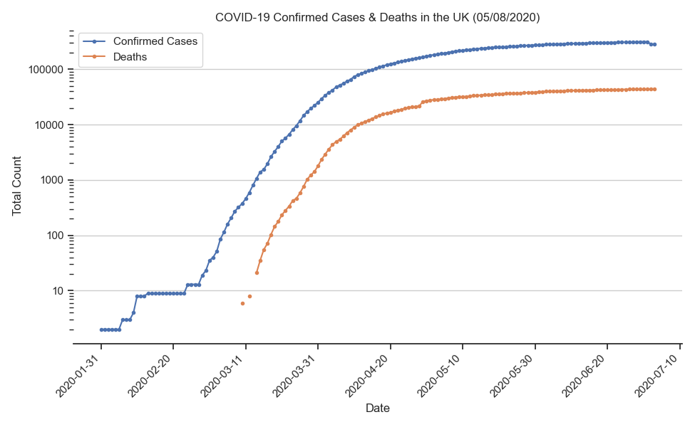

# COVID-19 UK

## What is COVID-19 UK?

COVID-19 UK aims to use the data from Public Health England to track and analyse the COVID-19 outbreak within the United Kingdom.

## Charts

### Confirmed Cases

### New Cases

### Growth factor

[Explanation by 3Blue1Brown](https://youtu.be/Kas0tIxDvrg)

> 

### Growth Trajectory

[Explanation by Minute Physics](https://youtu.be/54XLXg4fYsc)

